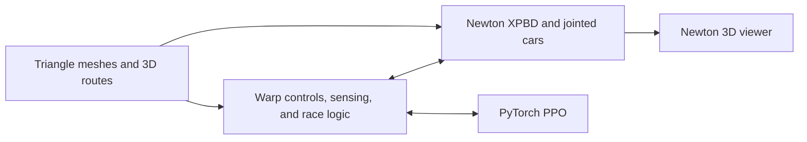

# warporacer3d architecture

Status: implemented from the approved design, with separate front steering and
axle hinges after testing the compact D6 joint proposal.

Newton XPBD handles rigid bodies, suspension, wheel contacts, gravity, and
integration. Warp kernels handle controls, lidar, progress, rewards, and resets.
PyTorch PPO uses the same CUDA device and stream. Performance tuning is deferred.

## Pure Warp feasibility

A compact 3D racer with a rigid chassis and raycast wheels is feasible in pure
Warp. A local CPU probe exercised mesh selection, ramp normals, overlapping
levels, closest-point queries, and quaternion transforms. Warp supplies these
geometry operations, GPU kernels, and Torch interoperability.

Physical wheels additionally need a joint/contact solver; modern Warp no longer
ships `warp.sim`. Newton reduces the physics code owned here while allowing
finite wheels to interact with curbs, ramp edges, walls, and landings. It is built
on Warp and satisfies the GPU requirement.

| Approach | Code owned by warporacer3d | Vehicle approximation |
| --- | --- | --- |
| Pure Warp with raycast wheels | Integration, suspension, grip, chassis collisions, race logic | Support sampled by rays |
| Newton with raycast wheels | Suspension/grip forces and race logic | Newton chassis, ray-sampled wheels |
| **Newton with physical wheels** | Car construction, controls, sensing, race logic | Jointed wheels and solver contacts |

## Geometry and routes

`Track` contains static triangle `MeshPart`s and an authored `Route`, in metres
with Z up. Geometry may contain ramps, banks, bridges, tunnels, gaps, and
obstacles; multiple surfaces may occupy the same XY location. Physics, lidar, and
rendering use the same geometry. A heightfield cannot represent this contract.

Route points, up vectors, widths, and an open/closed flag provide direction,
progress, and spawn frames. A junction can have several manifests sharing one
mesh and following different routes. There is no road-network planner.

YAML manifests reference OBJ/GLB or NPZ geometry and a route NPZ. Trimesh imports
scene geometry and bakes node transforms. Validation checks finite coordinates,
integer indices, degeneracy, nonzero route segments, widths, and route frames.
Authored road triangles must face up and obstacle faces outward: mesh queries and
Newton contacts reject back faces. Support rays validate spawn frames; the
importer cannot infer the intended winding of arbitrary open geometry.

The ROS image adapter retains the existing closed-loop centerline extraction,
then creates a flat road, boundary walls, and a 3D route. Its raster assumptions
stay in `legacy.py` and the adapter. Procedural flat, ramp, bank, overpass, and
jump examples use the regular mesh/route interface. Mesh maps have no global
floor beneath gaps. Concave geometry uses direct triangle/BVH contacts.

## Vehicle and controls

`CarSpec` defines dimensions, masses, wheel radius, suspension travel/gains,
friction, steering bounds/gains, drive torque, motor speed, and chassis drag.
`build_car(spec)` returns a Newton builder and named body/joint/shape IDs.

The car has eleven bodies: a chassis, four suspended carriers, two front
steering knuckles, and four cylinder wheels. Each carrier has a spring-damper
prismatic joint; each wheel has an axle hinge. Front knuckles have steering
hinges. Carrier and knuckle bodies have finite mass/inertia and no collision
shape. Internal car contacts are filtered explicitly.

The proposed nine-body car used D6 front joints combining steering and rolling.
The repeated-rotation test exposed ambiguous steering feedback as wheels spun.
Separate hinges keep the two angles independent. Hinge frames align their local
X axes with the physical axes, matching XPBD's twist decomposition. Steering
observations wrap equivalent quaternion angles into the principal interval.

Suspension uses Newton joint stiffness, damping, and travel limits. The rest pose
includes spring preload to avoid initial wheel penetration. Steering targets are
bounded and advance once per control step; Newton's implicit finite-gain drives
follow those targets. Wheel torques are bounded explicitly, since XPBD does not
implement built-in effort/velocity limits. A torque-speed curve also limits
free-spinning wheels during jumps. Linear chassis drag models passive losses.
No controller overwrites chassis velocity or heading. Contacts provide traction;
pitch, roll, sliding, takeoff, and landing follow from body dynamics. Tires use
contact friction rather than a calibrated slip or deformable-tire model.

## Ownership, batching, and step order

Each active map has a private `PhysicsBatch` owning a Newton model, XPBD solver,
collision pipeline, contacts, control, and two alternating states. Static map
geometry is shared globally in that model. Cars are replicated into independent
worlds at the same origin; world filtering prevents inter-car contacts. Mesh
objects remain alive with their model.

Each batch receives a contiguous slice of environment actions and outputs. This
supports arbitrary map geometry and part counts without relying on experimental
heterogeneous-world selection. Map rotation rebuilds physics models and resets
episodes, preserving the environment's output allocations and Torch views.

Newton owns body poses and velocities. `Env` owns steering targets, route and
episode state, randomization, actions, and outputs. Named IDs resolve bodies,
shapes, and joints without assuming buffer strides. Newton spatial vectors use
linear components first, angular components second, in world coordinates.

Each 60 Hz control step:

1. Advance the steering target once.
2. For each of 24 substeps, clear external forces, apply motor controls, collide,
   accumulate crash events, run 32 XPBD iterations, and swap state buffers.
3. Calculate progress, reward, and terminal reason.
4. Reset finished cars on the device, including every body, velocity, force,
   steering control, route reference, episode clock, and randomization state.
5. Observe the resulting or newly spawned poses.

The initial 12-substep/8-iteration settings produced unstable rolling; defaults
were increased after the drive tests. Timestep convergence is checked at rest.
Contacts are discrete; thin-wall tests cover the intended motor-speed range.
Chassis impacts, obstacles, prolonged rollover, falling/off-course motion,
timeouts, and open-route completion end episodes. Brief loss of wheel support
is allowed. `observe()` does not advance physics, episode clocks, or RNG. Readers
of Newton's bodies must resolve the current state after each buffer swap.

## Progress, sensing, and learning

Projection chooses the nearest 3D route segment within an arc-length window
around previous progress. Signed reward progress is bounded by physical travel;
only closed routes wrap. This retains the intended branch through self-crossings
and overpasses. Reverse travel produces negative progress, and respawns reset
the progress reference. Lateral width checks are independent of height, allowing
intended jumps.

Observations contain measured steering, chassis-frame linear/angular velocity,
projected gravity, four wheel-contact flags, and configurable 3D lidar ranges.
Every sensor mount and ray uses the full chassis transform. Rays query only the
selected map; misses return maximum range. Default lidar has three elevation
rows of 108 beams; the complete observation has 338 values.

`Agent` and `PPO` derive dimensions from `Env`. Ordinary Torch operations implement
rollouts, normalization, GAE, and clipped updates. Outputs use zero-copy Torch
views, with Warp and Torch environment operations using one Warp-owned blocking
CUDA stream. GPU event waits order that stream with the caller's current Torch
stream on entry and exit. This permits calls from different Torch streams and
protects temporary buffers allocated inside Newton. `Env.scope()` exposes the
same ordering for consumers of the environment's buffers. Host work is limited
to construction/import, viewer input/rendering, logging, and video encoding.
Version-2 checkpoints include dimensions, normalization, and configurations.

The optional Newton ViewerGL wrapper displays actual chassis and wheel poses.
Recording creates a separate evaluation environment, preserving training state
and reset RNG. Headless recording requires an OpenGL context.

## Dependencies and validation

Runtime uses Newton 1.6.0, Warp 1.17.0, and Trimesh 4.12.2 through `uv.lock`, plus
the existing Torch/scientific dependencies. Viewer dependencies are the optional
`viz` extra (`pyglet`, `imgui_bundle`); XPBD does not need MuJoCo. Local `../warp`
and `../newton` checkouts are references, not runtime path dependencies.

Behavior checks cover rest equilibrium, steering through repeated wheel turns,
forward/reverse drive, world isolation, slope gravity, banking, air/landing,
wall impacts, 3D lidar levels and orientation, route crossings/wrapping, open
completion, seeded selective resets, stable map-swap output views, mesh import,
legacy maps, and a PPO update. OpenGL rendering and MP4 recording were exercised;
recording was checked to leave training poses, clocks, observations, and reset
counts unchanged. Mesh-index tests reject values before narrowing to int32, so
overflowing indices cannot alias valid vertices. A CUDA-only test checks inputs,
observations, and resets across two non-default Torch streams, with delayed input
production to expose missing dependencies. Tests run on CPU here; CUDA residence
and execution require running the same suite on an NVIDIA machine. This Mac has
no Warp GPU device.

## Local references

- `../warp`: mesh/raycast examples, runtime geometry documentation, rendering,
  and Torch interoperability.
- `../newton/newton/examples/basic/example_basic_shapes.py`: XPBD, collisions,
  state swapping, and viewer integration.
- `../newton/newton/examples/basic/example_basic_joints.py`: joint construction.
- `../newton/newton/examples/robot/example_robot_omniwheel.py`: wheel construction
  and motor controls; its solver choice is not copied.
- `../newton/docs/concepts/worlds.rst`, `collisions.rst`, `conventions.rst`: world
  isolation, mesh contacts, and state conventions.
- `../newton/newton/_src/solvers/xpbd/solver_xpbd.py`: supported joints/drives and
  limitations. The local source snapshot is newer than the pinned release; the
  installed release's APIs were also inspected and executed.
